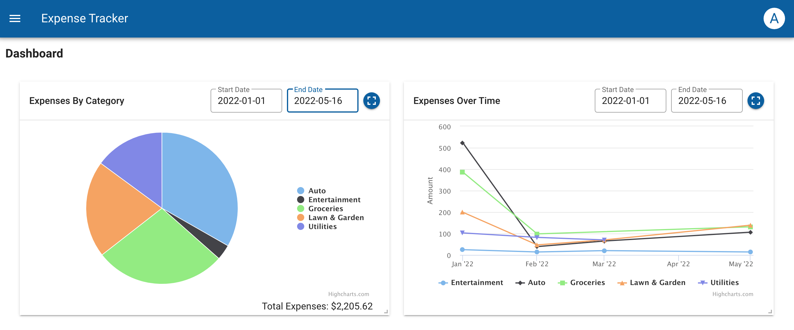
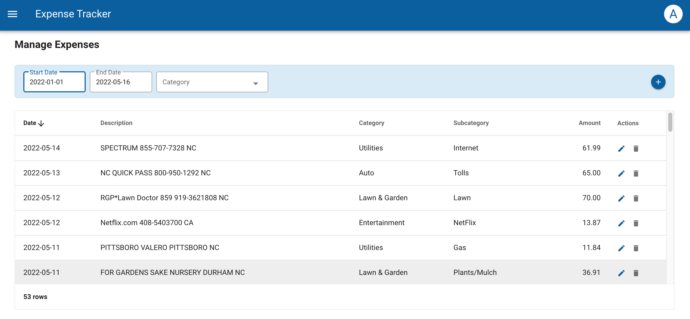

# vue-fb-expense-tracker





## WebApp Description

The vue-fb-expense-tracker application allows users to enter and report on their expenses.

- There are 5 main menu options: Dashboard, Categories, Manage Expenses, Expense Summary, and Imports.
- The Dashboard page displays a pie chart showing expenses by category and a time series chart showing category expenses over time.
- The Categories page allows users to View, Add, Update, and Delete categories and subcategories.
- The Manage Expenses page allows users to view/filter, add, update, and delete expenses, as well as assigning expenses to categories and subcategories
- The Expense Summary page allows users to summarize expenses by date and category.
- The Import Expenses page allows importing expense transactions from a CSV file that contains the following fields: trxDate, amount, description. The import process will automatically set category and subcategory values for expenses if there are any category mappings that match.

## Tech Stack

The web application is written in Javascript, Vue, Vuetify, and Highcharts. It uses Cloud Firestore for the database

## Dependencies

- Node and npm, which can be installed from https://nodejs.org/en/download/

## Install and run the Vue Expense Tracker web app in Developer mode

Clone the vue-fb-expense-tracker code

```shell
git clone https://github.com/LaeticiaW/vue-fb-expense-tracker.git
```

Change to app directory

```shell
cd vue-fb-expense-tracker
```

Install npm packages

```shell
npm install
```

Start the client web app in development mode, and then display in browser at http://localhost:8080

```shell
npm run serve
```

Notes about the Web App:

- To test out the Import Expenses feature, there is a sampleImportData.csv file in the vue-expense-tracker-server/database directory. It loads records for the month of May 2022. (In the Import Dialog, use date format MM-DD-YYYY, date position 1, amt position 2, description position 5)
- When filtering expense data in the app, note that the sample data expense dates are all from Jan to Apr/May 2022
